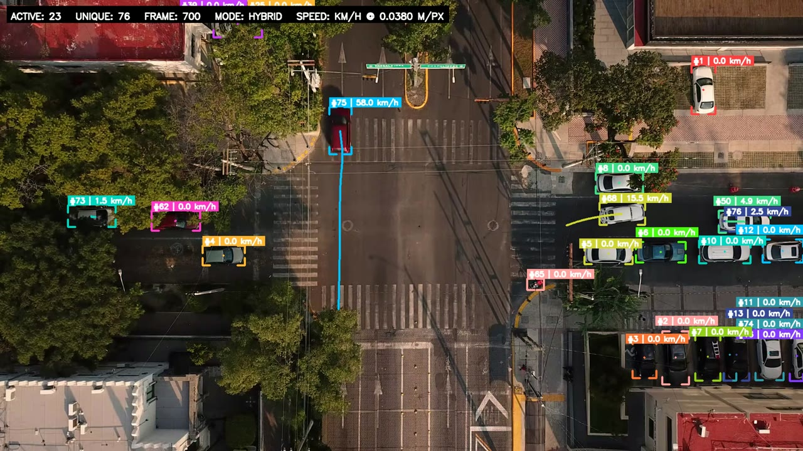
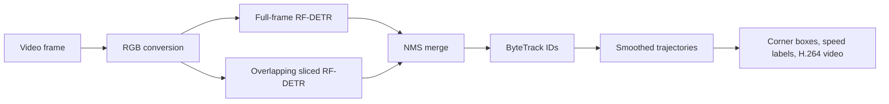

# Aerial Vehicle Detection, Tracking, and Speed Estimation

Production-oriented aerial vehicle analytics built with a fine-tuned
[RF-DETR Small](https://github.com/roboflow/rf-detr), Supervision-style sliced
inference, ByteTrack, and OpenCV/FFmpeg video processing.

The detector is trained as a single `vehicle` class covering cars, vans, trucks,
buses/freight vehicles, and motorcycles in drone and elevated-camera imagery.

[](https://huggingface.co/uwaisasghar/aerial-vehicle-detection-rfdetr)



[Watch or download the 1080p output demo](https://github.com/owaisasghar/aerial-vehicle-detection-rfdetr/releases/download/v1.0.0/output_youtube_corner_speed_estimated.mp4)
· [Additional tracking demo](https://github.com/owaisasghar/aerial-vehicle-detection-rfdetr/releases/download/v1.0.0/output_youtube_Mp6klx9oeZs_rfdetr_tracked.mp4)

## Highlights

- Fine-tuned RF-DETR Small detector for small aerial vehicles.
- Hybrid inference: full-frame context plus overlapping 960 px image slices.
- NMS merges full-frame and sliced predictions.
- ByteTrack assigns persistent vehicle IDs and motion traces.
- Corner-style or conventional full bounding boxes.
- Smoothed image-plane speed in px/s.
- Optional km/h conversion using a measured meters-per-pixel calibration.
- FP16 CUDA inference and high-quality H.264 output.
- Deterministic, leakage-aware dataset splitting by capture/video sequence.

## Model accuracy

The selected artifact is the best EMA checkpoint:
`checkpoint_best_total.pth`. Early stopping ended training after epoch 33 when
the monitored metric had not improved for 10 validation records. The best EMA
validation mAP@50:95 was **0.5843** at epoch 32.

### Held-out test results

The best checkpoint was loaded once and evaluated on the held-out test split of
3,083 images and 52,561 vehicle boxes.

| Metric | Score | Percentage |
|---|---:|---:|
| mAP@50:95 | 0.6477 | 64.77% |
| mAP@50 | 0.9180 | 91.80% |
| mAP@75 | 0.7498 | 74.98% |
| mAR@500 | 0.7082 | 70.82% |
| F1 (threshold sweep) | 0.8905 | 89.05% |
| Precision | 0.9247 | 92.47% |
| Recall | 0.8587 | 85.87% |

Object detectors do not have one universal classification-style “accuracy.”
The primary score here is COCO **mAP@50:95**, which averages performance across
IoU thresholds from 0.50 through 0.95. mAP@50 is more forgiving and describes
whether the detector generally found the vehicle; mAP@75 and mAP@50:95 place
more weight on tight box localization.

These test images come from the same three public dataset families as training,
although capture sequences were kept in only one split. A separate test set from
the intended production cameras is still required before deployment.

## Approach



1. **Detection** — RF-DETR Small predicts a single vehicle class at 768 px
   inference resolution.
2. **Small-object recovery** — `supervision.InferenceSlicer` processes
   overlapping 960×960 crops. This is a SAHI-style slicing approach without a
   separate SAHI dependency.
3. **Context recovery** — a full-frame prediction runs alongside the slices so
   medium/large vehicles are not lost when a crop removes useful context.
4. **Merge** — class-agnostic NMS at 0.50 IoU removes duplicate full/slice boxes.
5. **Tracking** — ByteTrack uses confidence and box motion to assign IDs.
6. **Speed** — least-squares velocity is calculated from one second of tracked
   box-center history, followed by exponential smoothing and stationary-jitter
   suppression.

## Dataset

The unified COCO dataset combines:

- [VisDrone2019-DET](https://github.com/VisDrone/VisDrone-Dataset) train and
  validation splits
- [UAVDT](https://sites.google.com/view/daweidu/projects/uavdt), using a
  community conversion with YOLO-format labels
- [DroneVehicle](https://github.com/VisDrone/DroneVehicle) RGB train and
  validation splits (infrared images are not used)

| Split | Images | Boxes | Negative images |
|---|---:|---:|---:|
| Train | 21,858 | 497,226 | 476 |
| Validation | 3,326 | 49,246 | 159 |
| Test | 3,083 | 52,561 | 93 |
| **Total** | **28,267** | **599,033** | **728** |

Source image totals are 19,445 DroneVehicle, 7,016 VisDrone, and 1,806 UAVDT
images. Valid negative images are deliberately retained to reduce false
positives.

### Dataset preparation and QA

- Maps supported vehicle categories into one `vehicle` class.
- Converts VisDrone text, UAVDT YOLO, and DroneVehicle XML/polygon annotations
  into COCO bounding boxes.
- Removes the documented DroneVehicle border and translates/clips annotations.
- Rejects corrupt images, invalid boxes, and zero-area boxes.
- Removes exact duplicate files.
- Groups likely frames from the same capture/video before splitting.
- Forces high-confidence perceptual matches into the same split group.
- Uses deterministic seed `42` and audits every final image and annotation.

Raw and prepared datasets are not included in this repository. Review and
follow each upstream dataset's terms before training or commercial use.

### Download and arrange the source datasets

Download each dataset from its linked project page. VisDrone and DroneVehicle
provide their download links on GitHub; UAVDT provides access from its official
benchmark page. The preparation script expects the extracted files in this
layout:

```text
datasets/
├── visdrone/raw/
│   ├── VisDrone2019-DET-train/
│   │   ├── images/
│   │   └── annotations/
│   └── VisDrone2019-DET-val/
│       ├── images/
│       └── annotations/
├── uavdt/raw/UAVDT/
│   ├── train/{images,labels}/
│   ├── val/{images,labels}/
│   └── test/{images,labels}/
└── dronevehicle/raw/
    ├── train/{trainimg,trainlabel}/
    └── val/{valimg,vallabel}/
```

The UAVDT reader expects YOLO text annotations (`class cx cy width height`,
normalized to the image size), not the benchmark's original annotation format.
If using the original release, convert its annotations to this layout first.

### How the training dataset is prepared

`prepare_dataset_v2.py` performs the complete conversion:

1. Reads VisDrone text annotations, UAVDT YOLO annotations, and DroneVehicle
   XML/polygon annotations.
2. Maps supported motor-vehicle categories into one COCO class named
   `vehicle`. For VisDrone these are car, van, truck, bus, and motor; for
   DroneVehicle they are car, truck, bus, van, and freight car.
3. Removes DroneVehicle's 100-pixel white border, converts oriented polygons to
   axis-aligned boxes, and clips every box to the image boundary.
4. Rejects corrupt images, missing/bad annotations, and boxes smaller than two
   pixels; valid images without vehicles are retained as negative examples.
5. Removes byte-identical images and groups capture sequences plus
   high-confidence perceptual matches before splitting, reducing leakage of
   neighboring or duplicated frames across train, validation, and test data.
6. Creates a deterministic 80/10/10 split with seed `42` and writes each split
   in RF-DETR-compatible COCO format.

From the repository root, prepare and verify the dataset with:

```bash
python -m pip install -r requirements.txt

python prepare_dataset_v2.py \
  --datasets datasets \
  --output prepared/aerial_vehicle_rfdetr \
  --seed 42

python audit_dataset.py --dataset prepared/aerial_vehicle_rfdetr
python validate_rfdetr_loader.py
```

The output directory must not already exist; this safeguard prevents an
accidental partial overwrite. The audit validates images and annotations and
reports possible cross-split visual matches for review. After it passes, start
training with `python train_rfdetr.py`.

## Training configuration

| Setting | Value |
|---|---|
| Model | RF-DETR Small |
| Task | One-class aerial vehicle detection |
| Resolution | 768 |
| Maximum epochs | 50 |
| Completed epoch | 33 (early stopped) |
| Batch size | 1 |
| Gradient accumulation | 16 |
| Effective batch size | 16 |
| Learning rate | 1e-4 |
| Encoder learning rate | 1.5e-4 |
| Augmentation | `AUG_AERIAL` |
| EMA | Enabled |
| Early-stopping patience | 10 |
| Seed | 42 |

Training was performed locally on an NVIDIA GeForce RTX 4060 Laptop GPU with
8 GB VRAM.

## Project structure

```text
.
├── infer_rfdetr_video.py       # Detection, slicing, tracking, speed, encoding
├── train_rfdetr.py             # RF-DETR training and resume entry point
├── prepare_dataset_v2.py       # Leakage-aware unified COCO preparation
├── audit_dataset.py            # Full dataset QA/audit
├── make_rfdetr_layout.py       # RF-DETR/Roboflow folder layout conversion
├── remove_split_duplicates.py  # Exact cross-split duplicate cleanup
├── validate_rfdetr_loader.py   # Data-loader validation
├── results/test_metrics.json   # Final measured test metrics
└── assets/demo_corner_speed.jpg
```

## Installation

Python 3.11 or 3.12 is recommended. FFmpeg is required for H.264 output.

```bash
sudo apt-get install ffmpeg

python3 -m venv .venv
source .venv/bin/activate
python -m pip install --upgrade pip
python -m pip install -r requirements.txt
```

For CUDA, install a PyTorch build compatible with the local NVIDIA driver. If a
Conda or robotics environment injects incompatible CUDA libraries, launch with
`env -u LD_LIBRARY_PATH` as shown below.

## Model checkpoint

The best checkpoint is approximately 124 MB and exceeds GitHub's normal 100 MB
file limit, so it is distributed as a GitHub Release asset instead of being
committed to the repository:

- [Download `checkpoint_best_total.pth`](https://github.com/owaisasghar/aerial-vehicle-detection-rfdetr/releases/download/v1.0.0/checkpoint_best_total.pth)
- [View the model card on Hugging Face](https://huggingface.co/uwaisasghar/aerial-vehicle-detection-rfdetr)
- SHA-256: `b7d80101d36bce349a09e3ee2965bc99195eafcb73054dd552e4b486d909202e`

Place the downloaded checkpoint at:

```text
runs/rfdetr_small_aerial_vehicle/checkpoint_best_total.pth
```

Alternatively, download it directly with the Hugging Face CLI:

```bash
hf download uwaisasghar/aerial-vehicle-detection-rfdetr \
  checkpoint_best_total.pth \
  --local-dir runs/rfdetr_small_aerial_vehicle
```

You may also pass any checkpoint path explicitly with `--weights`.

## Video inference

```bash
env -u LD_LIBRARY_PATH .venv/bin/python infer_rfdetr_video.py \
  --source input.mp4 \
  --output output_tracked.mp4 \
  --weights runs/rfdetr_small_aerial_vehicle/checkpoint_best_total.pth \
  --mode hybrid \
  --track-threshold 0.50 \
  --box-style corner
```

Useful modes:

- `--mode hybrid`: full frame plus slices; best quality and default.
- `--mode sliced`: slices only; strong small-object detail but less context.
- `--mode full`: fastest; may miss very small vehicles.
- `--box-style corner`: unobtrusive corner boxes.
- `--box-style full`: conventional rectangles.
- `--max-frames N`: short preview or tuning run.
- `--fp32`: disable CUDA FP16 optimization.

Run `python infer_rfdetr_video.py --help` for all options.

## Speed estimation

Without scene calibration, the script reports px/s. For km/h, measure a known
ground-plane distance visible in the video:

```text
meters_per_pixel = known_distance_in_meters / measured_distance_in_pixels
```

Then run:

```bash
env -u LD_LIBRARY_PATH .venv/bin/python infer_rfdetr_video.py \
  --source input.mp4 \
  --output output_speed.mp4 \
  --meters-per-pixel 0.038
```

The `0.038` value used in the included demonstration was estimated from a
typical 4.5 m car spanning about 118 pixels. It is appropriate for a visual
demo, not enforcement or safety decisions. Accurate deployment needs surveyed
ground control points and, for non-top-down cameras, a road-plane homography.

## Rebuilding the dataset and training

After placing the upstream datasets beneath `datasets/`:

```bash
source .venv/bin/activate
python prepare_dataset_v2.py --output prepared/aerial_vehicle_rfdetr
python audit_dataset.py --dataset prepared/aerial_vehicle_rfdetr
python validate_rfdetr_loader.py

env -u LD_LIBRARY_PATH python train_rfdetr.py
```

Resume from a Lightning checkpoint:

```bash
env -u LD_LIBRARY_PATH python train_rfdetr.py \
  --resume runs/rfdetr_small_aerial_vehicle/last.ckpt
```

## Limitations

- The model predicts one broad vehicle category rather than car/truck/bus
  subclasses.
- Severe tree cover, shadows, motion blur, truncation, or viewpoints unlike the
  training data can cause misses and false positives.
- ByteTrack IDs can change after long occlusion or leaving/re-entering the frame;
  cumulative IDs are not guaranteed to equal the physical vehicle count.
- Speed is image-plane motion until the scene is calibrated.
- The held-out public-dataset score does not replace production-camera testing.

## Repository data policy

The Git repository contains source code, documentation, a compressed demo image,
and small metric files only. The following remain local or are distributed as
separate authorized artifacts:

- upstream datasets and prepared images/annotations;
- training checkpoints and exported engines;
- source, preview, and rendered videos;
- virtual environments, caches, and logs.
